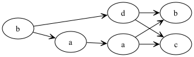
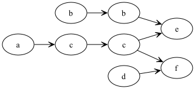

# Trace Theory Assignment

Solves tasks related to concurrency assignment.

## Table of Contents

- [Introduction](#introduction)
- [How to Run](#how-to-run)
- [Examples](#examples)
    - [Example 1](#example-1)
    - [Example 2](#example-2)

## Introduction

The program accomplishes the following tasks:

1. Determine the dependency relation D.
2. Determine the independence relation I.
3. Determine the Foata Normal Form FNF([w]) of trace [w].
4. Draw the dependency graph in minimal form for the word w.

## How to Run

Program was written in Kotlin 1.8 using Oracle OpenJDK 20.0.1.

To generate graphs you need to install **graphviz** library. On MacOS you can simply run:
```
brew install graphviz
```

To run the program with Maven, use the following command:

```bash
mvn exec:java -Dexec.mainClass="main.kotlin.Main" -Dexec.args="(a)x:=x+1 (b)y:=y+2z (c)x:=3x+z (d)w:=w+v (e)z:=y-z (f)v:=x+v A={a,b,c,d,e,f} w=acdcfbbe n=example3"
```
Replace `-Dexec.args` your own set of transactions, word **w**, alphabet **A** and optionally a name **n** of the file where the graph should be saved to.

Program comes with two examples. To try them, uncomment the example you want to run and comment the second. When you run the program with your own data, one example must be uncommented nevertheless.

## Examples

Example data and results are shown below.

### Example 1
```bash
mvn exec:java -Dexec.mainClass="main.kotlin.Main" -Dexec.args="(a)x:=x+y (b)y:=y+2z (c)x:=3x+z (d)z:=y-z A={a,b,c,d} w=baadcb n=example1"
```

```
Input(transactions=[Transaction(name=a, formula=x:=x+y), Transaction(name=b, formula=y:=y+2z), Transaction(name=c, formula=x:=3x+z), Transaction(name=d, formula=z:=y-z)], word=baadcb, vars=[x, y, z], fileName=example1)

Relations(relations={a=[a, b, c], b=[a, b, d], c=[a, c, d], d=[b, c, d]})

Dependency Matrix

| |a|b|c|d|
|a|1|1|1|0|
|b|1|1|0|1|
|c|1|0|1|1|
|d|0|1|1|1|

Independency Matrix

| |a|b|c|d|
|a|0|0|0|1|
|b|0|0|1|0|
|c|0|1|0|0|
|d|1|0|0|0|

Graph: 
Node b, ID: 0, Forward: (b, 5), (d, 3), (a, 2), (a, 1)
Node a, ID: 1, Forward: (b, 5), (c, 4), (a, 2)
Node a, ID: 2, Forward: (b, 5), (c, 4)
Node d, ID: 3, Forward: (b, 5), (c, 4)
Node c, ID: 4, Forward: 
Node b, ID: 5, Forward: 

Minimized graph: 
Node b, ID: 0, Forward: (d, 3), (a, 1)
Node a, ID: 1, Forward: (a, 2)
Node a, ID: 2, Forward: (b, 5), (c, 4)
Node d, ID: 3, Forward: (b, 5), (c, 4)
Node c, ID: 4, Forward: 
Node b, ID: 5, Forward: 

FNF([w]) = (b)(da)(a)(bc)
```



### Example 2

```bash
mvn exec:java -Dexec.mainClass="main.kotlin.Main" -Dexec.args="(a)x:=x+1 (b)y:=y+2z (c)x:=3x+z (d)w:=w+v (e)z:=y-z (f)v:=x+v A={a,b,c,d,e,f} w=acdcfbbe n=example2"
```

```
Input(transactions=[Transaction(name=a, formula=x:=x+1), Transaction(name=b, formula=y:=y+2z), Transaction(name=c, formula=x:=3x+z), Transaction(name=d, formula=w:=w+v), Transaction(name=e, formula=z:=y-z), Transaction(name=f, formula=v:=x+v)], word=acdcfbbe, vars=[x, y, z, w, v], fileName=example2)

Relations(relations={a=[a, c, f], b=[b, e], c=[a, c, e, f], d=[d, f], e=[b, c, e], f=[a, c, d, f]})

Dependency Matrix

| |a|b|c|d|e|f|
|a|1|0|1|0|0|1|
|b|0|1|0|0|1|0|
|c|1|0|1|0|1|1|
|d|0|0|0|1|0|1|
|e|0|1|1|0|1|0|
|f|1|0|1|1|0|1|

Independency Matrix

| |a|b|c|d|e|f|
|a|0|1|0|1|1|0|
|b|1|0|1|1|0|1|
|c|0|1|0|1|0|0|
|d|1|1|1|0|1|0|
|e|1|0|0|1|0|1|
|f|0|1|0|0|1|0|

Graph: 
Node a, ID: 0, Forward: (f, 4), (c, 3), (c, 1)
Node c, ID: 1, Forward: (e, 7), (f, 4), (c, 3)
Node d, ID: 2, Forward: (f, 4)
Node c, ID: 3, Forward: (e, 7), (f, 4)
Node f, ID: 4, Forward: 
Node b, ID: 5, Forward: (e, 7), (b, 6)
Node b, ID: 6, Forward: (e, 7)
Node e, ID: 7, Forward: 

Minimized graph: 
Node a, ID: 0, Forward: (c, 1)
Node c, ID: 1, Forward: (c, 3)
Node d, ID: 2, Forward: (f, 4)
Node c, ID: 3, Forward: (e, 7), (f, 4)
Node f, ID: 4, Forward: 
Node b, ID: 5, Forward: (b, 6)
Node b, ID: 6, Forward: (e, 7)
Node e, ID: 7, Forward: 

FNF([w]) = (adb)(cb)(c)(fe)
```


